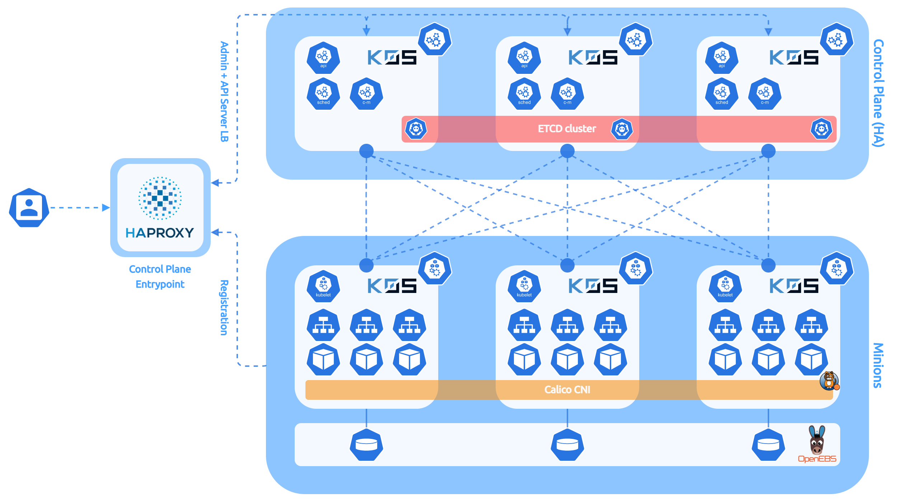

<p></p>

Various configurations and deployments for my personal Kubernetes lab cluster.

### Cluster specifications

**Overview**



**Components**

  - **Kubernetes distribution** : k0s 1.22.4 (with `k0sctl` as deployment tool)
  - **CRI** : containerd
  - **CNI** : Calico
  - **CSI** : OpenEBS
  - **Load Balancer** : MetalLB
  - **Ingress Controller** : Traefik

**Nodes specifications**

  - 1x HAProxy (Control Plane load balancer and administration entrypoint)
  - 3x Controller nodes in HA with `etcd` cluster embedded (2vCPU - 2GB RAM each)
  - 3x Worker nodes (8vCPU - 16GB RAM each)

### Bootstrap a cluster

To bootstrap a cluster, simply use the following command :

```shell
$ k0sctl apply -c ./k0s/cluster.yml
```

### References

- k0s : https://k0sproject.io/
- k0sctl : https://github.com/k0sproject/k0sctl
- Calico : https://www.tigera.io/project-calico/
- MetalLB : https://metallb.universe.tf/
- OpenEBS : https://openebs.io/
- Traefik : https://traefik.io/
