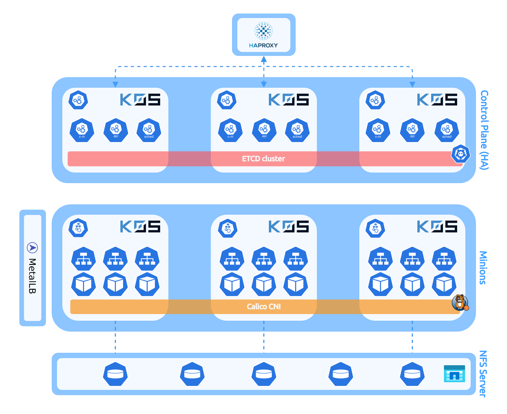

Repository containing all configurations used to deploy my personal Kubernetes lab cluster.

## Cluster design

### Overview

### Components

  - **Kubernetes distribution** : k0s v1.23.1
  - **CRI** : containerd
  - **CNI** : Calico
  - **CSI** : NFS Subdir External Provisioner
  - **Ingress Controller** : HAProxy Ingress Controller
  - **Load Balancer** : MetalLB

### Nodes description

  - 1x **HAProxy external LB** for Control Plane entrypoint and nodes registration
  - 1x **NFS Server** to provide persistent storage (through NFS External Provisioner)
  - 3x **Controller** nodes in HA mode with `etcd` cluster embedded (with 2vCPU/2GB RAM each)
  - 3x **Worker** nodes (with 8vCPU/16GB RAM each)
 
The cluster is composed of KVM virtual machines managed by [LXD](https://linuxcontainers.org/lxd/).

## Cluster administration

* **Cluster bootstrap**
  - [Bootstrap a cluster with k0s/k0sctl](cluster/k0s/)
* **Service deployments**
  - [ArgoCD](deployments/argocd)
  - [HAProxy Kubernetes Ingress Controller](deployments/haproxy-ingress)
  - [Velero](deployments/velero)

## References

- **ArgoCD** : https://github.com/argoproj/argo-cd/
- **Calico** : https://www.tigera.io/project-calico/
- **HAProxy** : https://www.haproxy.com/
- **HAProxy Ingress Controller** : https://github.com/haproxytech/kubernetes-ingress
- **k0s** : https://k0sproject.io/
- **k0sctl** : https://github.com/k0sproject/k0sctl
- **NFS Subdir External Provisioner** : https://github.com/kubernetes-sigs/nfs-subdir-external-provisioner
- **MetalLB** : https://metallb.universe.tf/
- **Velero** : https://github.com/vmware-tanzu/velero
