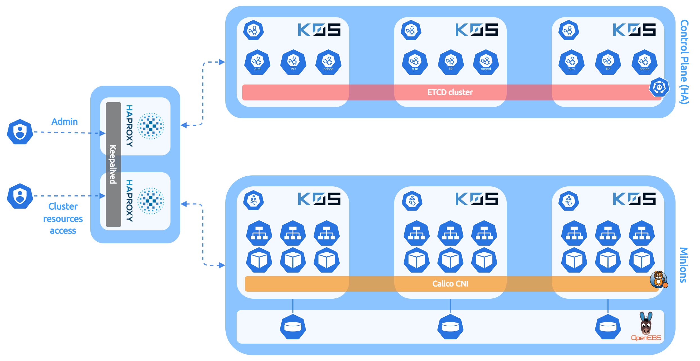

Repository containing all configurations used to deploy my personal Kubernetes lab cluster.

## Cluster design

### Overview**

### Components**

  - **Kubernetes distribution** : `k0s` 1.22.4 
  - **CRI** : containerd
  - **CNI** : Calico
  - **CSI** : OpenEBS
  - **Ingress Controller** : HAProxy Ingress Controller
  - **Load Balancer (external)** : HAProxy

### Nodes description**

  - 2x **HAProxy external LB** in dual Active/Passive mode (Control Plane/administration entrypoint, nodes registration and Load Balancing for cluster resources access)
  - 3x **Controller** nodes in HA mode with `etcd` cluster embedded (with 2vCPU/2GB RAM each)
  - 3x **Worker** nodes (with 8vCPU/16GB RAM + 100GB of block storage each)
 
The cluster is composed of KVM virtual machines managed by [LXD](https://linuxcontainers.org/lxd/).

## References

- Calico : https://www.tigera.io/project-calico/
- HAProxy : https://www.haproxy.com/
- HAProxy Ingress Controller : https://www.haproxy.com/documentation/kubernetes/latest/
- k0s : https://k0sproject.io/
- k0sctl : https://github.com/k0sproject/k0sctl
- OpenEBS : https://openebs.io/
